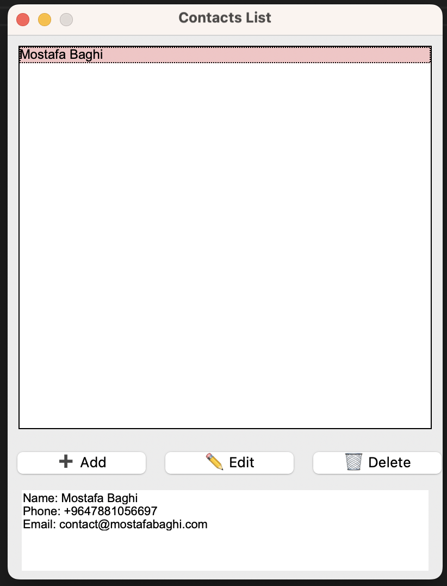

# 📇 Python Contacts List

A simple and lightweight desktop contact manager built with Python and Tkinter.  
This app allows you to create, view, edit, and delete contact information, stored locally as `.txt` files in a `contacts/` folder.

---

## ✨ Features

- 🔍 View all contacts in a scrollable list
- ➕ Add new contact with name, phone, and email
- ✏️ Edit existing contacts
- 🗑️ Delete contacts
- 🧾 Automatically stores each contact in a `.txt` file
- 📁 Works offline — no database or internet required

---

## 📂 Folder Structure

```
project-folder/
├── main.py
└── contacts/
    ├── John_Doe.txt
    ├── Jane_Smith.txt
    └── ...
```

Each contact file contains:
```
Name: John Doe
Phone: 123-456-7890
Email: john@example.com
```

---

## 🛠️ Requirements

Just make sure you have Python 3.x installed.

If Tkinter is not installed, run:

```bash
pip install tk
```

---

## ▶️ How to Run

1. Place `main.py` in your working folder.
2. Create a `contacts/` folder in the same directory (if not already created automatically).
3. Run the app:

```bash
python main.py
```

---

## 📸 Screenshot

> 📸 Screenshot of the app interface:


---

## 🙌 Author

Made with ❤️ by [Mostafa Baghi](https://github.com/mostafabaghi)